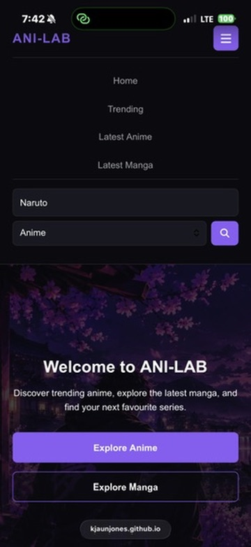
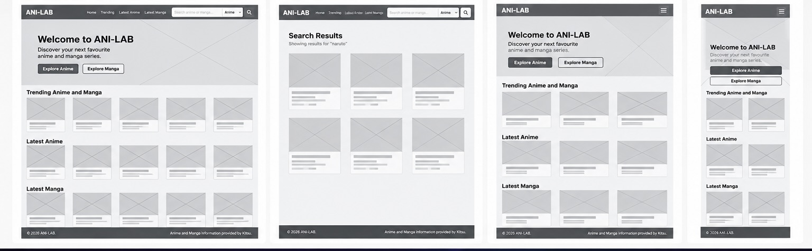
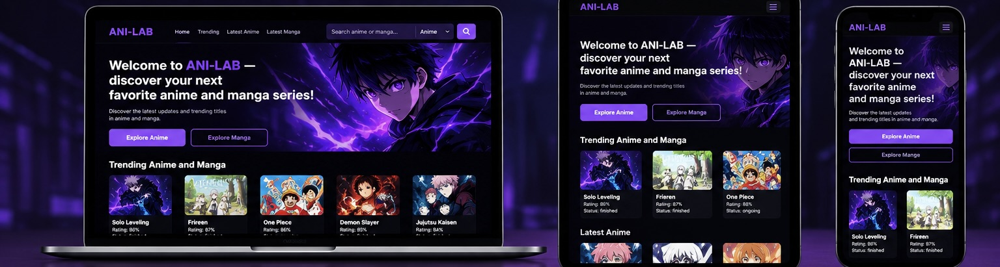
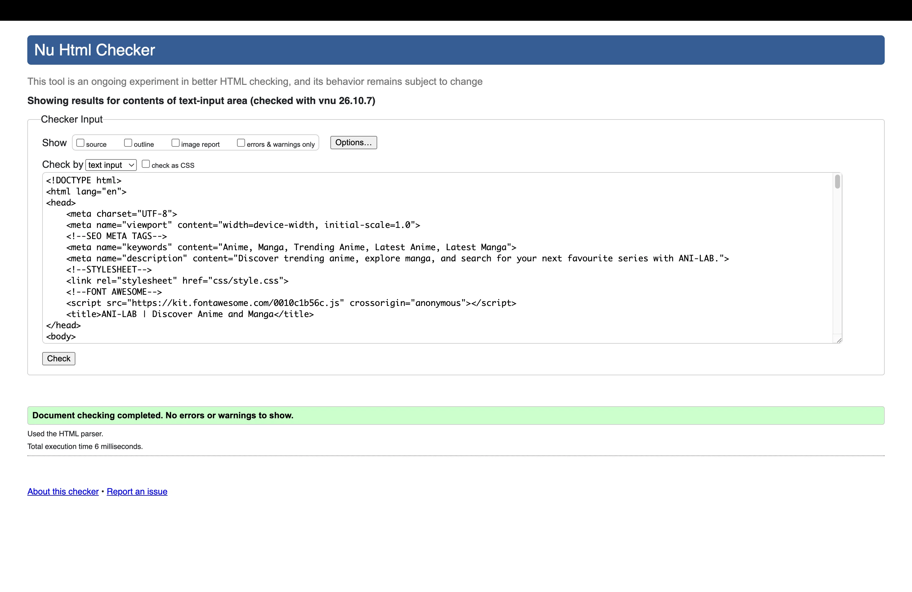
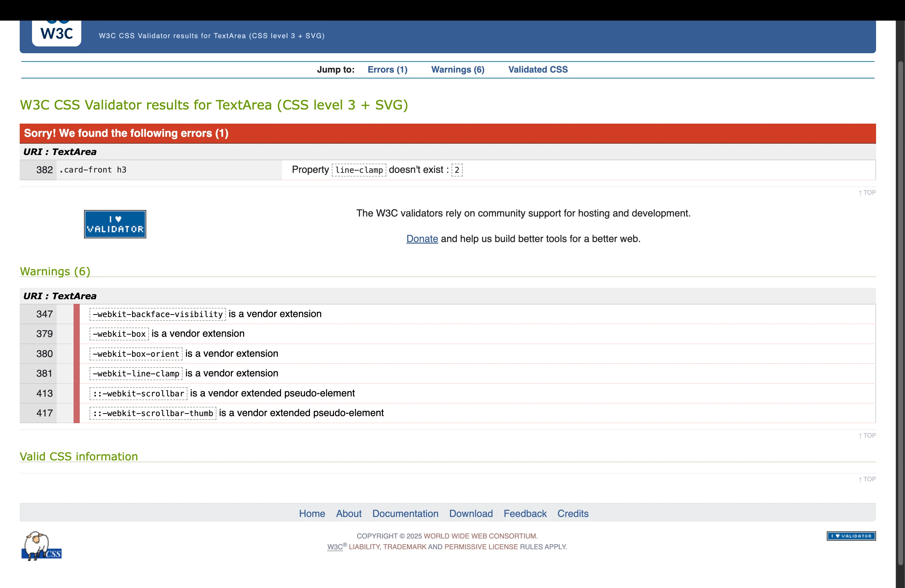
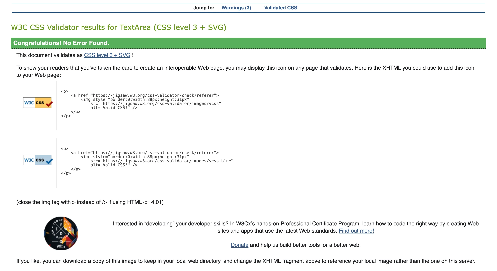
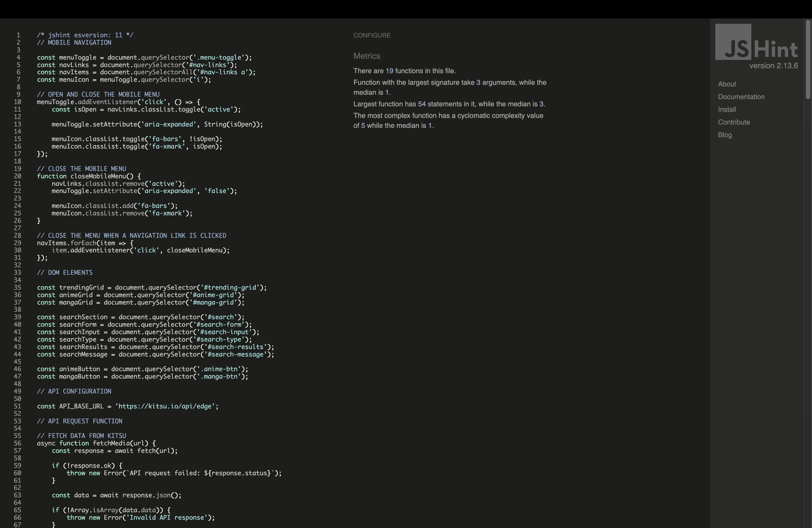
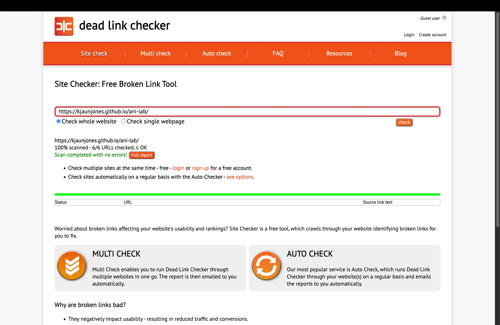
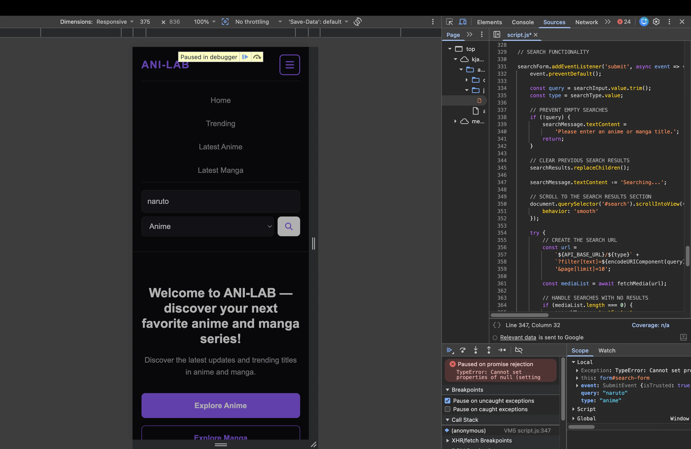
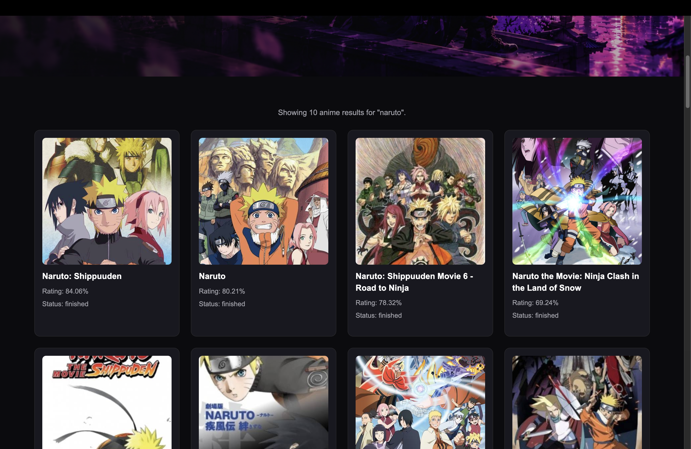

# ANI-LAB

[View Live Website](https://kjaunjones.github.io/ani-lab/) | [GitHub Repository](https://github.com/kjaunjones/ani-lab)

## Project Overview

ANI-LAB is an interactive anime and manga discovery website developed
as my second portfolio project for the Code Institute Level 5 Diploma
in Web Application Development.

The website allows users to discover top-rated anime, explore recently
released anime and manga, and search for specific titles.

ANI-LAB uses the Kitsu API to retrieve anime and manga information
dynamically, providing users with an interactive experience.

The application was developed using HTML5, CSS3 and JavaScript, with
an emphasis on responsive design, accessibility, usability and
interactive functionality.

The project demonstrates my understanding of front-end development,
DOM manipulation, asynchronous JavaScript, API integration and
responsive web design.

---

# Table of Contents

1. [Project Goals](#project-goals)
2. [User Experience](#user-experience)
3. [Design](#design)
4. [Features](#features)
5. [Technologies Used](#technologies-used)
6. [API Integration](#api-integration)
7. [Accessibility](#accessibility)
8. [Testing](#testing)
9. [Bugs and Fixes](#bugs-and-fixes)
10. [Deployment](#deployment)
11. [Future Improvements](#future-improvements)
12. [Credits](#credits)
13. [Acknowledgements](#acknowledgements)

---

# Project Goals

The main objective of ANI-LAB is to create an interactive and
responsive website that allows users to discover anime and manga
through a simple and accessible interface.

The project aims to:

- Provide information about popular and recently released anime.
- Allow users to discover recently released manga.
- Enable users to search for specific anime and manga titles.
- Display information retrieved dynamically from an external API.
- Create interactive cards containing additional information.
- Provide a consistent experience across different screen sizes.
- Implement accessible navigation and keyboard interactions.
- Demonstrate JavaScript DOM manipulation and asynchronous programming.

The website is designed for anime and manga enthusiasts who want
to explore titles without navigating multiple websites.

---

# User Experience

## Target Audience

ANI-LAB is aimed at:

- Anime enthusiasts looking for new series.
- Manga readers searching for new titles.
- Users interested in discovering highly rated anime.
- Users who want to search for information about specific titles.
- Casual viewers looking for recommendations.

The website is designed to make discovering anime and manga
straightforward and enjoyable.

## User Stories

### First-Time Visitors

As a first-time visitor, I want to:

- Understand the purpose of the website immediately.
- Navigate between different sections easily.
- Discover popular anime without searching manually.
- Explore recently released anime and manga.
- Use the website on my phone or computer.

### Returning Visitors

As a returning visitor, I want to:

- Search for anime and manga titles.
- View additional information about a title.
- Discover new content when I revisit the website.
- Navigate between sections without unnecessary page reloads.

### Accessibility

As a user with accessibility requirements, I want to:

- Navigate the website using a keyboard.
- Understand the purpose of interactive elements.
- Access meaningful text alternatives for images.
- Receive feedback when searching for content.
- Use the website across different screen sizes.

---

# Design

## Colour Scheme

ANI-LAB uses a dark colour scheme inspired by modern anime
streaming and discovery platforms.

The primary colours are:

| Colour | Hex Code | Purpose |
|--------|----------|---------|
| Purple | `#8b5cf6` | Primary accent colour |
| Grey | `#a1a1aa` | Secondary text and details |
| Dark | `#0b0b0f` | Main background |
| White | `#ffffff` | Primary text |
| Dark Grey | `#181820` | Cards and content containers |

The dark background provides contrast against the purple
accent colour and helps the anime poster images stand out.

Purple is used to highlight interactive elements and
maintain a consistent visual identity.

## Typography

The website uses a clean, readable font to maintain clarity
across desktop and mobile devices.

Typography is organised using headings, paragraphs and
supporting information.

A consistent heading hierarchy helps users understand
the structure of the website.

## Layout

ANI-LAB uses a single-page layout with separate sections for
different types of content.

The main sections are:

1. Navigation
2. Hero
3. Search Results
4. Top-Rated Anime
5. Latest Anime
6. Latest Manga
7. Footer

CSS Grid and Flexbox are used to organise content and
adapt the layout to different screen sizes.

## Responsive Design

The website is designed to work across desktop, tablet
and mobile devices.

Responsive styling allows content cards and navigation
elements to adapt to the available screen width.

On smaller screens, the navigation changes to a collapsible
menu to improve usability.

The responsive design was inspected using browser
developer tools, including a mobile viewport of 375px.

### Mobile View



## Wireframes

Wireframes help communicate the intended layout and
organisation of the website before implementation.




## Mockup

A mockup gives you a more visual representation of what the site should look like.



---

# Features

## Navigation Bar

The navigation bar provides links to the main sections
of the website.

These include:

- Home
- Trending
- Latest Anime
- Latest Manga

The navigation uses anchor links to allow users to
move between sections of the page.

### Mobile Navigation

On smaller screens, a menu button allows users to
open and close the navigation.

JavaScript controls the menu's visibility and updates
the `aria-expanded` attribute to communicate its state
to assistive technologies.

The menu also closes when a navigation link is selected.

## Hero Section

The hero section introduces ANI-LAB and explains the
purpose of the website.

It contains two interactive buttons:

- Explore Anime
- Explore Manga

JavaScript event listeners allow these buttons to
scroll to their corresponding content sections.

Smooth scrolling provides a more seamless experience.

## Top-Rated Anime

The Top-Rated Anime section displays anime titles
retrieved from the Kitsu API.

The API request sorts anime by average rating.

Each title is displayed using a dynamically generated
media card.

## Latest Anime

The Latest Anime section retrieves anime information
from the Kitsu API.

Results are sorted by their start date to display
recently released titles.

## Latest Manga

The Latest Manga section displays manga titles
retrieved from the Kitsu API.

Results are sorted by start date.

The information displayed for manga differs from
anime where appropriate.

For example, manga cards may display chapter and
volume counts rather than episode counts.

## Search Functionality

ANI-LAB includes a search form that allows users
to search for anime or manga titles.

Users can:

1. Enter a title into the search field.
2. Select Anime or Manga.
3. Submit the search.
4. View matching results.

The search functionality uses JavaScript to process
the user's input and send a request to the Kitsu API.

Search results are displayed dynamically without
reloading the page.

### Search Feedback

The website provides feedback during the search process.

Examples include:

- Searching...
- No results found.
- Showing matching results.
- Unable to complete your search.

These messages help users understand the current
state of the application.

## Interactive Flip Cards

Anime and manga information is displayed using
interactive cards.

The front of each card displays information such as:

- Poster image
- Title
- Rating
- Status

Users can interact with a card to reveal additional
information on the reverse.

Depending on the media type, this includes:

- Synopsis
- Episode count
- Chapter count
- Volume count
- Status

JavaScript adds and removes a CSS class to control
the card's flipped state.

The cards support mouse and keyboard interaction.

Users can activate them using Enter or Space.

## Dynamic Content

The website uses JavaScript to generate content
dynamically from API responses.

Rather than hardcoding individual anime and manga
cards into the HTML, the application creates
elements using DOM methods.

This approach reduces duplicated markup and
allows the displayed information to change when
new data is retrieved.

## Loading and Error Messages

ANI-LAB displays loading messages while requesting
content from the API.

If a request fails, the application displays an
appropriate error message.

This prevents the page from appearing unresponsive
when data cannot be retrieved.

## Missing Data Handling

Not every anime or manga title contains complete
information.

The website includes fallback values for missing
information.

Examples include:

- Unknown
- Untitled
- N/A
- No synopsis available
- Poster unavailable

These fallbacks help maintain a consistent layout
when API responses contain incomplete information.

---

# Technologies Used

## Languages

### HTML5

HTML5 provides the semantic structure of the website.

Elements such as `header`, `nav`, `main`, `section`,
`article` and `footer` are used to organise content.

### CSS3

CSS3 is used to style the website and create
responsive layouts.

Techniques include:

- Flexbox
- CSS Grid
- Media queries
- CSS custom properties
- Hover effects
- Transitions
- Card transformations

### JavaScript

JavaScript provides the website's interactive
functionality.

It is used for:

- DOM manipulation
- Event handling
- API requests
- Asynchronous programming
- Search functionality
- Dynamic content generation
- Card interactions
- Mobile navigation

## External Resources

### Kitsu API

The Kitsu API provides anime and manga information.

Website:

https://kitsu.io/

### Font Awesome

Font Awesome provides icons used throughout
the website.

Website:

https://fontawesome.com/

## Development Tools

### Visual Studio Code

Used to develop and organise the project's
HTML, CSS and JavaScript files.

### Git

Used for version control and tracking changes
during development.

### GitHub

Used to host the project repository.

### GitHub Pages

Used to deploy the website.

### Chrome Developer Tools

Used to inspect responsive layouts, investigate
JavaScript errors and debug application behaviour.

## Validation Tools

The following tools were used during testing:

- Nu HTML Checker
- W3C CSS Validation Service
- JSHint
- Dead Link Checker
- Chrome Developer Tools

---

# API Integration

ANI-LAB uses the Kitsu API to retrieve anime
and manga information.

The API base URL is:

```javascript
const API_BASE_URL = 'https://kitsu.io/api/edge';
```

## Fetching Data

The application uses the JavaScript Fetch API
to retrieve information asynchronously.

The `fetchMedia()` function handles requests
and checks whether the response is successful.

```javascript
async function fetchMedia(url) {
    const response = await fetch(url);

    if (!response.ok) {
        throw new Error(`API request failed: ${response.status}`);
    }

    const data = await response.json();

    if (!Array.isArray(data.data)) {
        throw new Error('Invalid API response');
    }

    return data.data;
}
```

This function:

1. Sends a request to the API.
2. Checks the HTTP response.
3. Converts the response to JSON.
4. Checks the expected response structure.
5. Returns the media data.

## API Endpoints

### Top-Rated Anime

```text
https://kitsu.io/api/edge/anime?page[limit]=10&sort=-averageRating
```

This endpoint retrieves anime sorted by average rating.

### Latest Anime

```text
https://kitsu.io/api/edge/anime?page[limit]=10&sort=-startDate
```

This endpoint retrieves anime sorted by start date.

### Latest Manga

```text
https://kitsu.io/api/edge/manga?page[limit]=10&sort=-startDate
```

This endpoint retrieves manga sorted by start date.

### Search

The search functionality constructs a request
using the selected media type and search query.

The search term is passed through the
`filter[text]` query parameter.

The application uses `URL` and `URLSearchParams`
to construct the request.

## Error Handling

API requests are handled using `try...catch`
statements.

If a request fails, the error is logged to
the browser console and a message is displayed
to the user.

This improves usability when the API is unavailable
or a network request cannot be completed.

## Security Considerations

The application uses `textContent` to insert
API-provided text into the page.

This avoids interpreting API text as HTML
and reduces the risk of HTML injection.

No private API credentials are required for
the public Kitsu endpoints used by ANI-LAB.

---

# Accessibility

Accessibility was considered during the development
of ANI-LAB.

## Semantic HTML

Semantic elements are used to structure the page
and provide meaningful information to browsers
and assistive technologies.

Examples include:

- `header`
- `nav`
- `main`
- `section`
- `article`
- `footer`

## Alternative Text

Anime and manga poster images are given descriptive
alternative text based on their titles.

Example:

```javascript
image.alt = `${title} poster`;
```

## Keyboard Navigation

Interactive cards support keyboard interaction.

Users can activate a card using Enter or Space.

```javascript
card.addEventListener('keydown', event => {
    if (event.key === 'Enter' || event.key === ' ') {
        event.preventDefault();
        flipCard();
    }
});
```

## ARIA Attributes

ARIA attributes provide additional information
about interactive elements.

Examples include:

- `aria-label`
- `aria-expanded`
- `aria-controls`
- `aria-pressed`
- `aria-live`
- `aria-hidden`

The mobile navigation updates its expanded state
when the menu opens or closes.

Interactive cards update their pressed state
when flipped.

## Search Feedback

The search feedback element uses:

```html
<p id="search-message" role="status" aria-live="polite" hidden></p>
```

This provides a mechanism for communicating
search updates to assistive technologies.

## Accessibility Limitations

Although accessibility features have been
implemented, these do not guarantee full
WCAG compliance.

A dedicated accessibility audit would be
required to confirm compliance.

---

# Testing

Testing was carried out during development
to identify errors and improve the website's
functionality.

Testing included:

- HTML validation
- CSS validation
- JavaScript validation
- Broken-link checking
- Browser developer tools
- Responsive layout inspection
- Debugging interactive functionality

## Manual Testing

The following table identifies the main
functional tests for the application.

| Feature | Test | Expected Result | Status |
|---------|------|-----------------|--------|
| Navigation | Select Home | Scroll to hero | PASS |
| Navigation | Select Trending | Scroll to trending section | PASS |
| Navigation | Select Latest Anime | Scroll to anime section | PASS |
| Navigation | Select Latest Manga | Scroll to manga section | PASS |
| Mobile Menu | Select menu button | Navigation opens | PASS |
| Mobile Menu | Select navigation link | Navigation closes | PASS |
| Hero | Select Explore Anime | Scroll to latest anime | PASS |
| Hero | Select Explore Manga | Scroll to latest manga | PASS |
| Search | Search for Naruto | Matching anime displayed | PASS |
| Search | Search for manga | Matching manga displayed | PASS |
| Search | Search for nonexistent title | No-results feedback displayed | PASS |
| Search | Submit empty search | Browser validation prevents submission | PASS |
| Cards | Select anime card | Card flips to show details | PASS |
| Cards | Select manga card | Card flips to show details | PASS |
| Cards | Press Enter on focused card | Card flips | PASS |
| Cards | Press Space on focused card | Card flips | PASS |
| API | Load homepage | Content sections populate | PASS |
| API | API request fails | Error message displayed | PASS |
| Responsive | View at 375px | Layout remains usable | Inspected |
| Links | Run Dead Link Checker | No broken links | Passed |

The search error identified during development
was subsequently fixed.

---

# HTML Validation

The HTML was tested using the Nu HTML Checker.

Validator:

https://validator.w3.org/nu/

The final validation screenshot reported:

| Result | Count |
|--------|-------|
| Errors | 0 |
| Warnings | 0 |

The HTML passed the validator's checks
without reported errors or warnings.



---

# CSS Validation

The CSS was tested using the W3C CSS
Validation Service.

Validator:

https://jigsaw.w3.org/css-validator/

## Initial Results

The initial validation identified:

| Result | Count |
|--------|-------|
| Errors | 1 |
| Warnings | 6 |

One issue involved the `line-clamp`
property, which was not accepted by
the validator.



## Correction

The relevant CSS was updated to use
an alternative method of restricting
the visible height of card titles.

The alternative uses properties such as:

```css
line-height: 1.4;
max-height: 2.8em;
overflow: hidden;
```

This approach limits the visible title
height without using the unsupported
unprefixed property.

## Final Results

The final validation screenshot reported:

| Result | Count |
|--------|-------|
| Errors | 0 |
| Warnings | 3 |

The remaining warnings were associated
with browser-specific CSS styling.

The final stylesheet contained no
reported validation errors.



---

# JavaScript Validation

JavaScript was checked using JSHint.

Validator:

https://jshint.com/

## Initial Issues

During validation, JSHint initially
reported warnings associated with
modern JavaScript syntax.

The following directive was added:

```javascript
/* jshint esversion: 11 */
```

This configures JSHint to recognise
the JavaScript language features used
by the project.

## Remaining Formatting Warnings

A later validation reported two warnings
related to misleading line breaks
before ternary operators.

These were identified in:

- The rating display logic.
- The accessible label for interactive cards.

## Corrections

The rating expression was reformatted:

```javascript
const rating = attributes.averageRating ? `${attributes.averageRating}%` : 'N/A';
```

The card label expression was also
reformatted:

```javascript
const cardLabel = isFlipped ? `${title}. Press Enter or Space to return to the poster.` : `${title}. Press Enter or Space to view details.`;
```

The current project source contains
these formatting changes.



After correcting the formatting warnings, I revalidated the JavaScript using JSHint. The final validation passed without errors or warnings.

---

# Broken Link Testing

The deployed website was tested
using Dead Link Checker.

Website tested:

https://kjaunjones.github.io/ani-lab/

The screenshot showed:

| Result | Count |
|--------|-------|
| URLs Checked | 6 |
| Successful URLs | 6 |
| Broken Links | 0 |

No broken links were identified
among the six URLs checked.



---

# Responsive Testing

Responsive behaviour was inspected
using Chrome Developer Tools.

A mobile viewport of 375px was
included in the testing evidence.

The responsive implementation includes:

- A collapsible mobile navigation.
- Content layouts that adapt to screen width.
- Responsive spacing.
- Interactive elements accessible on mobile.


---

# Bugs and Fixes

During development, several issues
were identified through validation
and debugging.

Documenting these issues demonstrates
the testing and problem-solving process.

## Bug 1: JavaScript Search Error

### Problem

During development, a JavaScript error
occurred when the search functionality
attempted to update the search message.

Chrome Developer Tools displayed:

```text
TypeError: Cannot set properties of null
```

The error was associated with:

```javascript
searchMessage.textContent = 'Searching...';
```

### Investigation

The error indicated that the
`searchMessage` variable did not
reference an available DOM element
when the code attempted to update it.

The HTML and JavaScript references
were reviewed during debugging.

### Resolution

The search issue was subsequently
corrected.

The current HTML includes:

```html
<p id="search-message" role="status" aria-live="polite" hidden></p>
```

The JavaScript references this element
using:

```javascript
const searchMessage = document.querySelector('#search-message');
```

### Outcome

The search error was reported as fixed
during development.





---

## Bug 2: CSS Validation Error

### Problem

The CSS validator reported an error
associated with the `line-clamp`
property.

### Investigation

The property was identified during
W3C CSS validation.

### Resolution

The unsupported property was replaced
with an alternative approach using
line height, maximum height and
overflow handling.

### Outcome

The CSS was validated again.

The final report showed zero errors
and three warnings.


---

## Bug 3: JavaScript Formatting Warnings

### Problem

JSHint reported two warnings
related to misleading line breaks
in ternary expressions.

### Investigation

The warnings identified formatting
that could make the conditional
expressions less readable.

### Resolution

Both expressions were reformatted
to place the conditional operator
on the same line.

### Outcome

The corresponding changes are
present in the current JavaScript.


---

# Deployment

ANI-LAB is deployed using GitHub Pages.

Live website:

https://kjaunjones.github.io/ani-lab/

Repository:

https://github.com/kjaunjones/ani-lab

## Deployment Process

The website is hosted in a GitHub
repository containing the project's
HTML, CSS, JavaScript and assets.

The deployment process uses
GitHub Pages to publish the
website from the repository.

The following steps describe how
to deploy the project using the
main branch.

1. Open the GitHub repository.
2. Select **Settings**.
3. Select **Pages**.
4. Under **Build and deployment**,
   select **Deploy from a branch**.
5. Select the `main` branch.
6. Select the `/ (root)` folder.
7. Save the settings.
8. Wait for GitHub Pages to deploy
   the website.
9. Open the published URL.

## Updating the Website

Changes can be uploaded using Git.

Example:

```bash
git add .
git commit -m "Update ANI-LAB website"
git push origin main
```

After pushing changes, GitHub Pages
publishes the updated files through
its configured deployment process.

## Running Locally

To run the project locally:

1. Clone the repository.

```bash
git clone https://github.com/kjaunjones/ani-lab.git
```

2. Navigate to the project directory.

```bash
cd ani-lab
```

3. Open the project in Visual Studio Code.

```bash
code .
```

4. Open `index.html` using a local
   development server, such as
   the VS Code Live Server extension.

5. Use the website in your browser.

An internet connection is required
to retrieve data from the Kitsu API
and load externally hosted resources.

---

# Future Improvements

Although ANI-LAB provides its core
anime and manga discovery features,
there are opportunities for further
development.

## Pagination

Currently, API requests retrieve
a limited number of results.

Pagination could allow users
to browse additional titles.

## Filtering

Additional filters could allow
users to search by:

- Genre
- Release year
- Rating
- Status

## Favourites

A favourites feature could allow
users to save titles for later.

Browser local storage could
be used to store favourites
without requiring an account.

## Detailed Media Pages

Dedicated pages could provide
additional information about
individual anime and manga titles.

## Improved Loading Indicators

Animated loading indicators
could improve feedback during
API requests.

## Accessibility Improvements

Further accessibility testing
could identify opportunities
to improve keyboard interaction,
focus visibility and screen
reader compatibility.

---

# Credits

## API

Anime and manga information
is provided by the Kitsu API.

https://kitsu.io/

## Icons

Icons are provided by
Font Awesome.

https://fontawesome.com/

## Development Resources

The following resources were
used during development:

- Code Institute learning materials
- MDN Web Docs
- W3C documentation
- JavaScript documentation

## Images

Anime and manga poster images
are retrieved from the Kitsu API.

The ownership of these images
remains with their respective
copyright holders.

---

# Acknowledgements

ANI-LAB was developed as part
of my Code Institute Level 5
Diploma in Web Application
Development.

The project provided an
opportunity to apply the
knowledge gained during
the Interactive Front End
Development module.

Through developing ANI-LAB,
I gained practical experience
in:

- JavaScript programming
- Working with external APIs
- Asynchronous data retrieval
- DOM manipulation
- Responsive web design
- Accessibility
- Debugging
- Validation
- Version control
- Website deployment

The project helped strengthen
my understanding of how
HTML, CSS and JavaScript
work together to create
interactive web applications.

### Use of Artificial Intelligence

OpenAI's ChatGPT was used as a supplementary learning resource
throughout the development of ANI-LAB.

AI assistance included tutoring and explaining programming
concepts, providing debugging guidance, reviewing code,
suggesting improvements, and proofreading and assisting with
the drafting of project documentation.

All AI-generated suggestions were reviewed and adapted to
the project's requirements. I remained responsible for
understanding the code, implementing and testing functionality,
and verifying the accuracy of the submitted work.

AI was used to support my learning and development process,
rather than replace my understanding of the technologies used.

---

# Project Links

**Live Website:**

https://kjaunjones.github.io/ani-lab/

**GitHub Repository:**

https://github.com/kjaunjones/ani-lab/

---

© 2026 ANI-LAB.